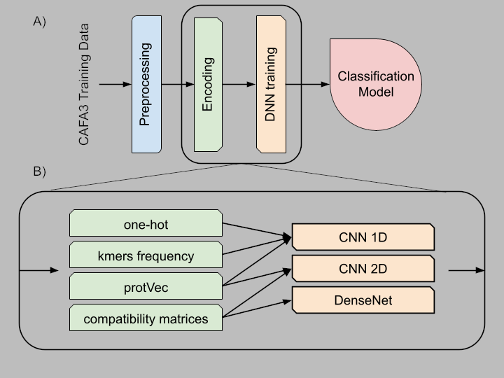
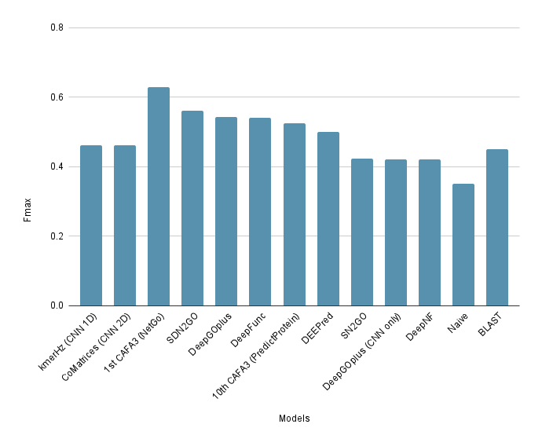
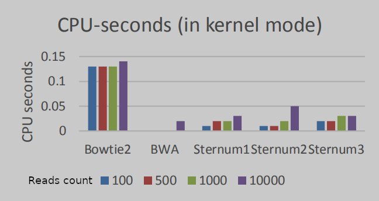
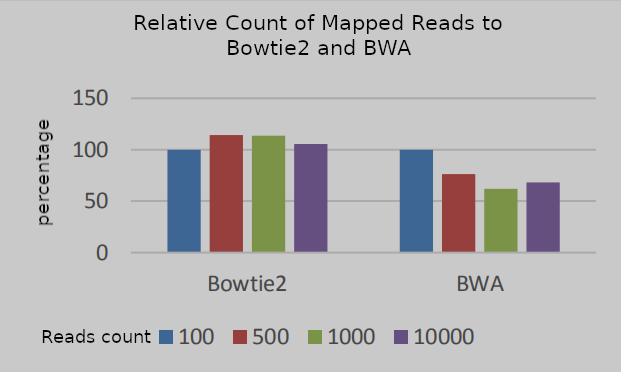
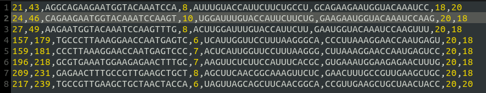
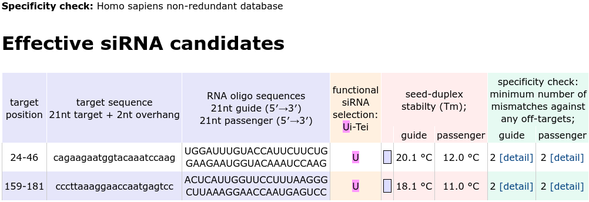

# Bioinformatics Projects

- [Bioinformatics Projects](#bioinformatics-projects)
  - [GOlite](#golite)
  - [Sternum](#sternum)
  - [siRNAdesigner](#sirnadesigner)

## GOlite

[GitHub Repo](https://github.com/anazhmetdin/GOlite)

GOlite is a python package that trains different Neural Network models for protein function prediction while focusing on using limited computational resources. It adapts to different encodings by building dynamic DNN structures. It's designed to train on encoded data produced by my other package [protEncoder](https://github.com/anazhmetdin/protEncoder).

There are multiple options for protein sequence encoding, and multiple options also for building the DNN based on the selected encoding paatern.

Here is a Fmax scores comparison between two of the best models of GOlite and the top 10 models in [CAFA3](https://biofunctionprediction.org/cafa/) (Critical Assessment of protein Function Annotation, a global experiment to asses the advances in this field). The performance is comparable while cutting down the computational resources significantly.

## Sternum

[GitHub Repo](https://github.com/anazhmetdin/Sternum)

The Sternum project is a Python package designed to map Next Generation Sequencing (NGS) short reads to a reference genome using various algorithms and data structures. It offers three main methods: Suffix Tree (Trie), Suffix Array (SA), and Burrow Wheeler Transform (BWT). The performance of this package is comparable with two of the best available tools for short reads mapping: [Bowtie2](https://github.com/BenLangmead/bowtie2) & [BWA](https://github.com/lh3/bwa)

CPU seconds to map different numbers of reads with default parameters of each tool:

Percentage of mapped reads by Sternum(BWT) compared to other tools

## siRNAdesigner

[GitHub Repo](https://github.com/anazhmetdin/siRNAdesigner)

- This is a siRNA designer that follows a set of rules based on published research to select and score suitable targets from the input sequence.
- It supports plain text sequence input and NCBI Sequence Accession Number.
- It offers an option to reduce off-target effect by applying more strict rules.
- The achieved results of this tool is similar to [siDirect](https://sidirect2.rnai.jp/) results.

The selected sequences resulting from this tool

The selected sequences by siDirect

