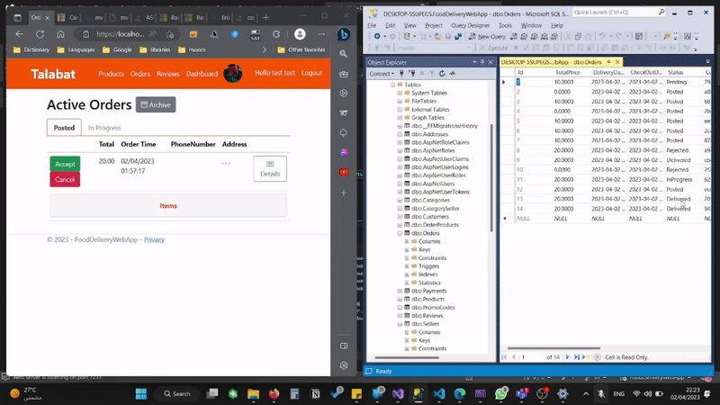
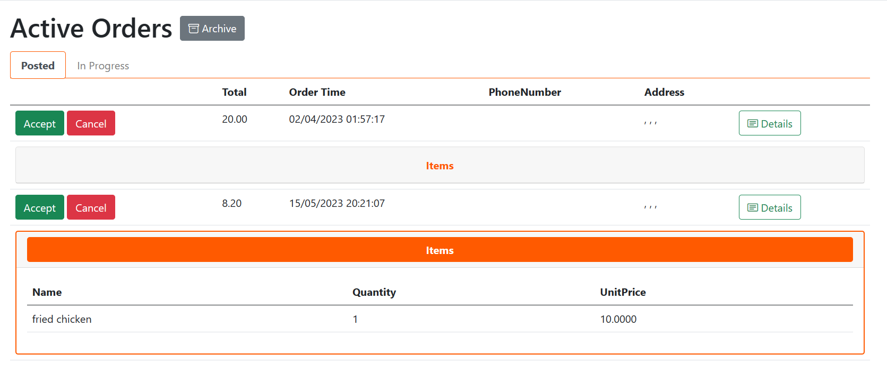

# .NET Projects

* [ASP.NET Core MVC](#ASP.NET Core MVC)

## ASP.NET Core MVC

[Food Delivery Web Application](https://github.com/anazhmetdin/FoodDeliveryWebApp)

In this application I was responsible developing the seller interface. I integrated ASP.NET Core SignalR to push notifications of live orders.

[HQ Video with audio](https://drive.google.com/file/d/1hUC08H2q4nuRkJKIiHdhKiZCkoNtXHI8/view)

Order items could be expanded:

