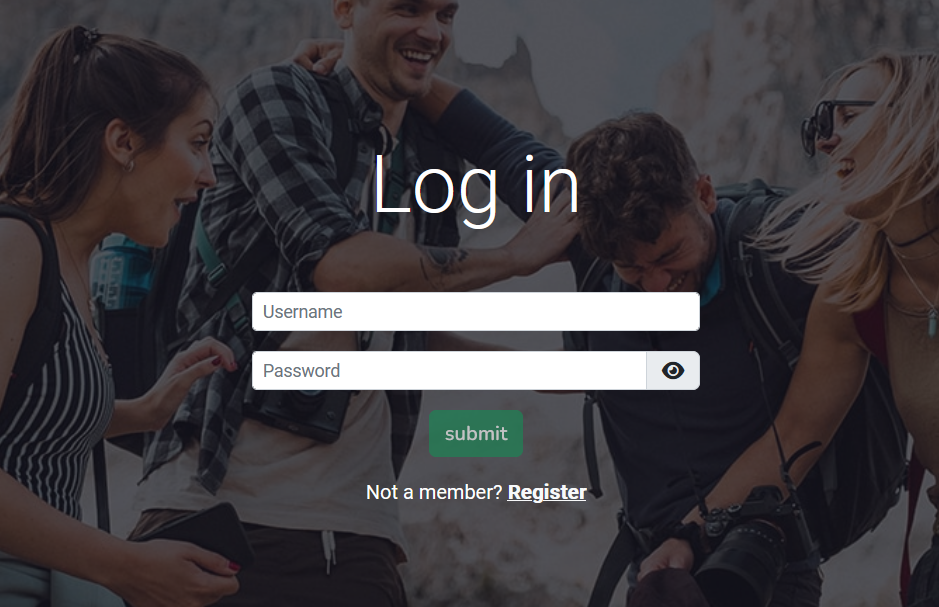

# .NET Projects

- [.NET Projects](#net-projects)
  - [ASP.NET Core MVC](#aspnet-core-mvc)
  - [ASP.NET Core Web API](#aspnet-core-web-api)

## ASP.NET Core MVC

[Food Delivery Web Application](https://github.com/anazhmetdin/FoodDeliveryWebApp)

In this application, my primary responsibility was to develop the seller interface. As part of this role, I successfully integrated ASP.NET Core SignalR to enable real-time push notifications for live orders.

[HQ Video with audio](https://drive.google.com/file/d/1hUC08H2q4nuRkJKIiHdhKiZCkoNtXHI8/view)

Order items could be expanded:

Additionally, I utilized Chart.js to create visually appealing and informative graphs, providing sellers with valuable insights into their performance over time.

Moreover, I designed and implemented a user-friendly interface for efficient management of a seller's items, incorporating quick and intuitive controls like filters, sales application, and availability modification. These controls are used alongside a fixed header at the top with anchor links to all available categories.

[HQ Video](https://drive.google.com/file/d/1mk3kSelXGrkSJf0CIvZm77aySx6UHy0q/view)

Finally, I added a section in the customer homepage to display trending sellers (those with the highest order rates in the last few days). This section is updated regularly using a timed hosted service that runs in the background.

## ASP.NET Core Web API

[Seetour API](https://github.com/anazhmetdin/SeetourAPI)
[Seetour UI](https://github.com/eman120/SeetourUI)

In the "Seetour" project, I was the scrum master who managed our sprints and contributed to various aspects, including:

- Designed the database schema for the project and utilized a Python script to populate it with realistic mock data.
- Managed the integration of external services, such as the Google Maps API and Azure Storage account, ensuring the secure handling of associated secrets.
- Implemented policy-based authorization throughout the ASP.NET Core Web API, ensuring access control and security measures were enforced consistently across the application.
- Developed an interceptor in Angular to seamlessly handle the login JWT token, facilitating secure authentication and authorization processes.
- Designed and developed the login page in Angular, providing an intuitive and user-friendly interface for users to authenticate and access the system.

