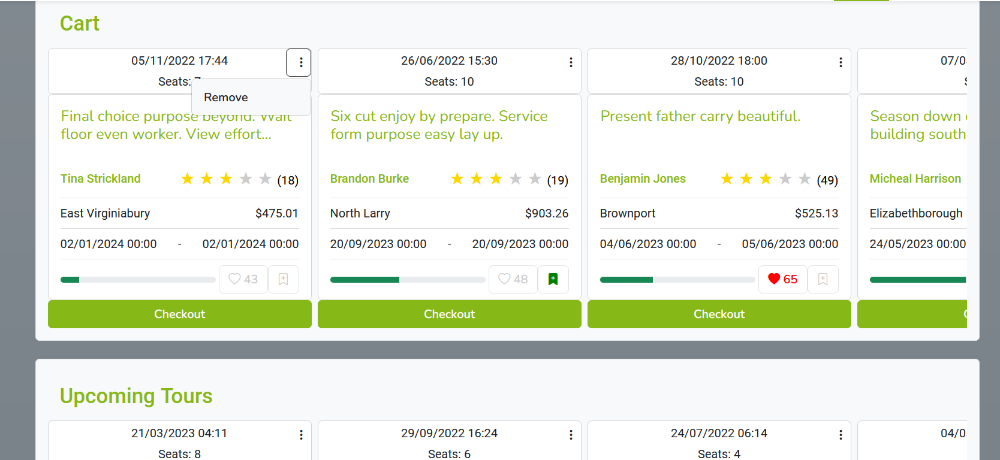
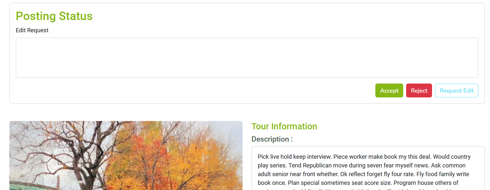

# .NET Projects

- [.NET Projects](#net-projects)
  - [ASP.NET Core MVC](#aspnet-core-mvc)
  - [ASP.NET Core Web API](#aspnet-core-web-api)
  - [WPF .NET](#wpf-net)

## ASP.NET Core MVC

[Food Delivery Web Application](https://github.com/anazhmetdin/FoodDeliveryWebApp)

In this application, my primary responsibility was to develop the seller interface. As part of this role, I successfully integrated ASP.NET Core SignalR to enable real-time push notifications for live orders.

[HQ Video with audio](https://drive.google.com/file/d/1hUC08H2q4nuRkJKIiHdhKiZCkoNtXHI8/view)

Order items could be expanded:

Additionally, I utilized Chart.js to create visually appealing and informative graphs, providing sellers with valuable insights into their performance over time.

Moreover, I designed and implemented a user-friendly interface for efficient management of a seller's items, incorporating quick and intuitive controls like filters, sales application, and availability modification. These controls are used alongside a fixed header at the top with anchor links to all available categories.

[HQ Video](https://drive.google.com/file/d/1mk3kSelXGrkSJf0CIvZm77aySx6UHy0q/view)

Finally, I added a section in the customer homepage to display trending sellers (those with the highest order rates in the last few days). This section is updated regularly using a timed hosted service that runs in the background.

## ASP.NET Core Web API

[Seetour API](https://github.com/anazhmetdin/SeetourAPI)
[Seetour UI](https://github.com/eman120/SeetourUI)

In the "Seetour" project, I was the scrum master who managed our sprints and contributed to various aspects, including:

- Designed the database schema for the project and utilized a Python script to populate it with realistic mock data.
- Managed the integration of external services, such as the Google Maps API and Azure Storage account, ensuring the secure handling of associated secrets.
- Implemented policy-based authorization throughout the ASP.NET Core Web API, ensuring access control and security measures were enforced consistently across the application.
- Developed an interceptor in Angular to seamlessly handle the login JWT token, facilitating secure authentication and authorization processes.
- Designed and developed the login page in Angular, providing an intuitive and user-friendly interface for users to authenticate and access the system.

- Implemented the trending section, which displays the top liked, wishlisted, and booked tours based on user activity within the past few days. This feature enhances the user experience by showcasing popular and trending tours. This list is updated daily on the api server using a timed hosted service that I created also.

- Created a comprehensive tours browser that allows users to search for specific tours using a query, as well as apply filters based on various criteria such as price, tour guide rating, category, date, location, and more. This functionality enables users to easily find tours that match their preferences.

- Integrated the ability to sort tours within the browser based on different properties, such as price, rating, or any other relevant attribute. Moreover, I implemented a customizable sorting feature that allows users to change the priority of sorting criteria, such as prioritizing price or rating first, based on their individual preferences.

- All the previously mentioned browser features are reflected in the query parameters, so that the user can search the link with other people to sea the same exact result he got.
- Developed a favorites functionality that allows customers to add tour guides to their favorites list. This feature enables users to follow the upcoming tours of their preferred tour guides in a separate section, providing a personalized experience.

- Created a centralized page where customers can manage their cart and booked tours. This page allows users to conveniently book tours from their cart, remove tours, cancel bookings, review completed tours, and view a list of their cancelled tours. This comprehensive tour management page simplifies the process for users to handle their tour reservations efficiently.

- Customers can review their completed tours in the same page using a simple form where they can upload multiple photos from their trip. the can see the uploaded photos and add to them or remove some of them easily.

- Tour Guides can visit their own profiles to view their own upcoming and past tours plus all of the reviews they got from their customers.

- Finally, I developed a part of the admin controls that enables controlling posting requests and tour guides' applicantions to be a partner with Seetour.

## WPF .NET

[Hotel Management](https://github.com/anazhmetdin/hotelmanagement)

This project was developed using EF Core with code-first approach. I designed a well-structured and normalized database that effectively stored guest information, room details, payment records, and more. To enhance the user experience, I developed a user interface using WPF, ensuring seamless navigation through the data. To achieve a cohesive and professional aesthetic, I implemented customized control styling consistently across the application.

- Login window

- Returning customers' data is loaded automatically using their SSN

- Available rooms are loaded dynamically using new reservation info and the existing reservations

- Returning Customers' payment information is loaded when they pay for a new reservation

- All data could be searched using a single query

- Reserved rooms and occupied rooms (checked in) could be viewed in one place.

- Active reservations are loaded dynamically in the main tab

- All reservations could be viewed in a doubly-bound grid view

- Room service could also login to the application and view their to-do list

