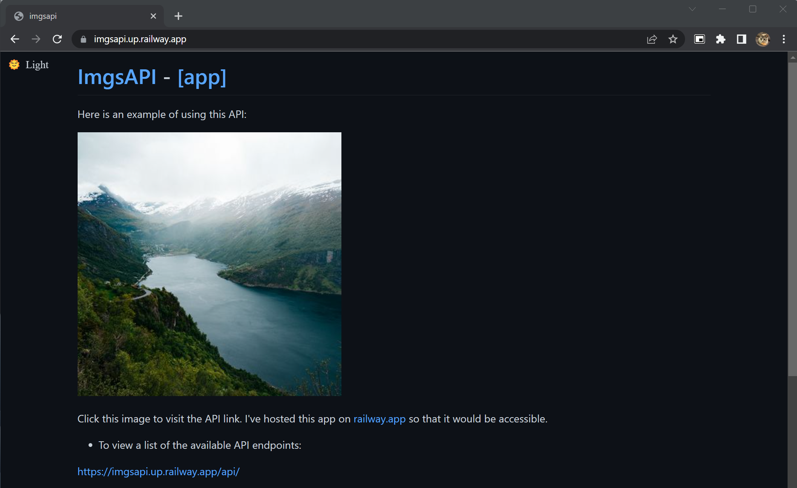
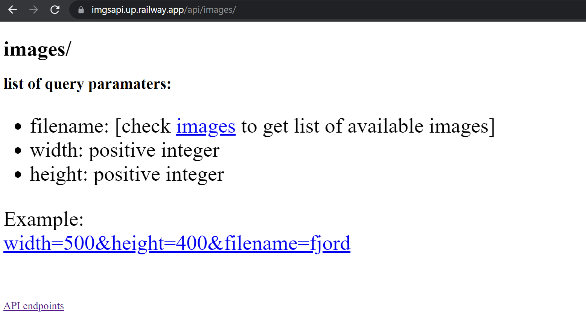
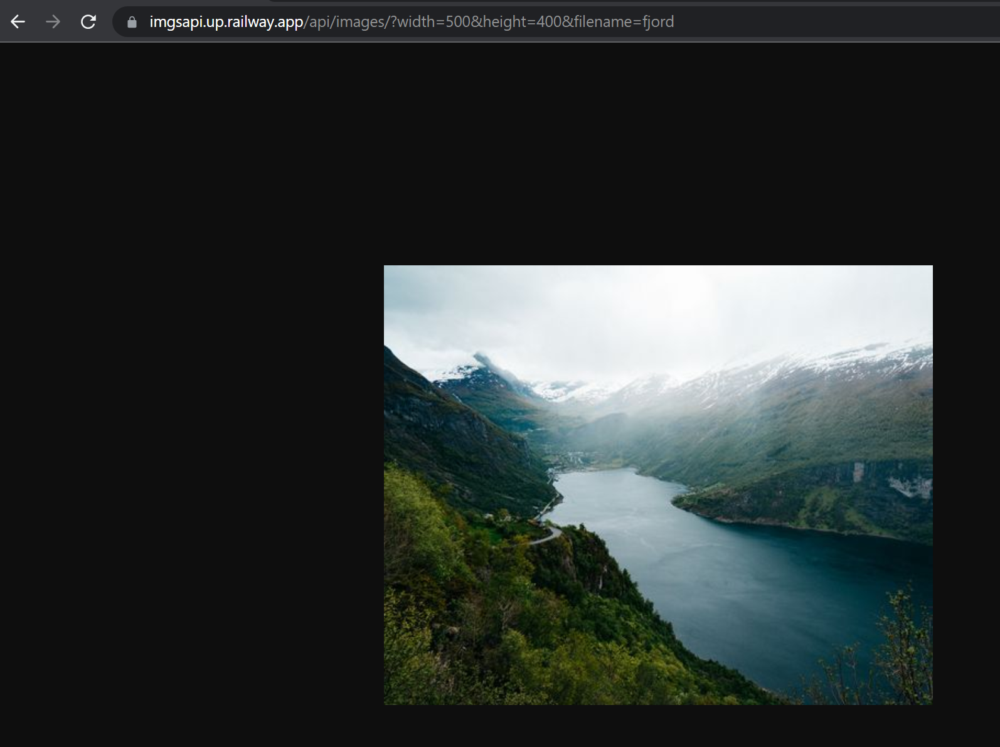
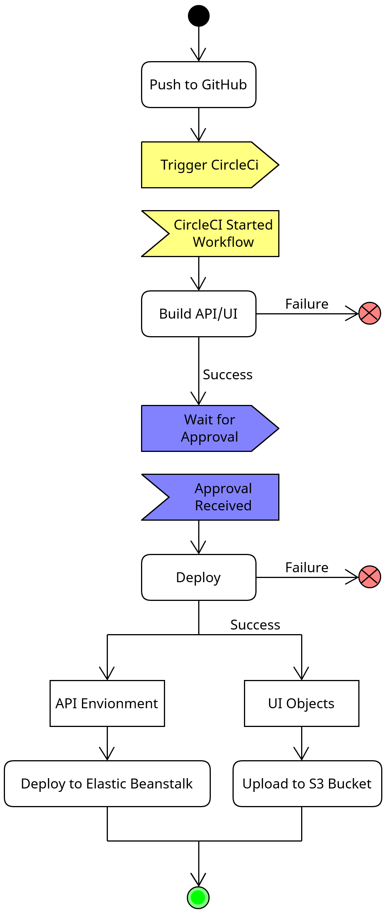
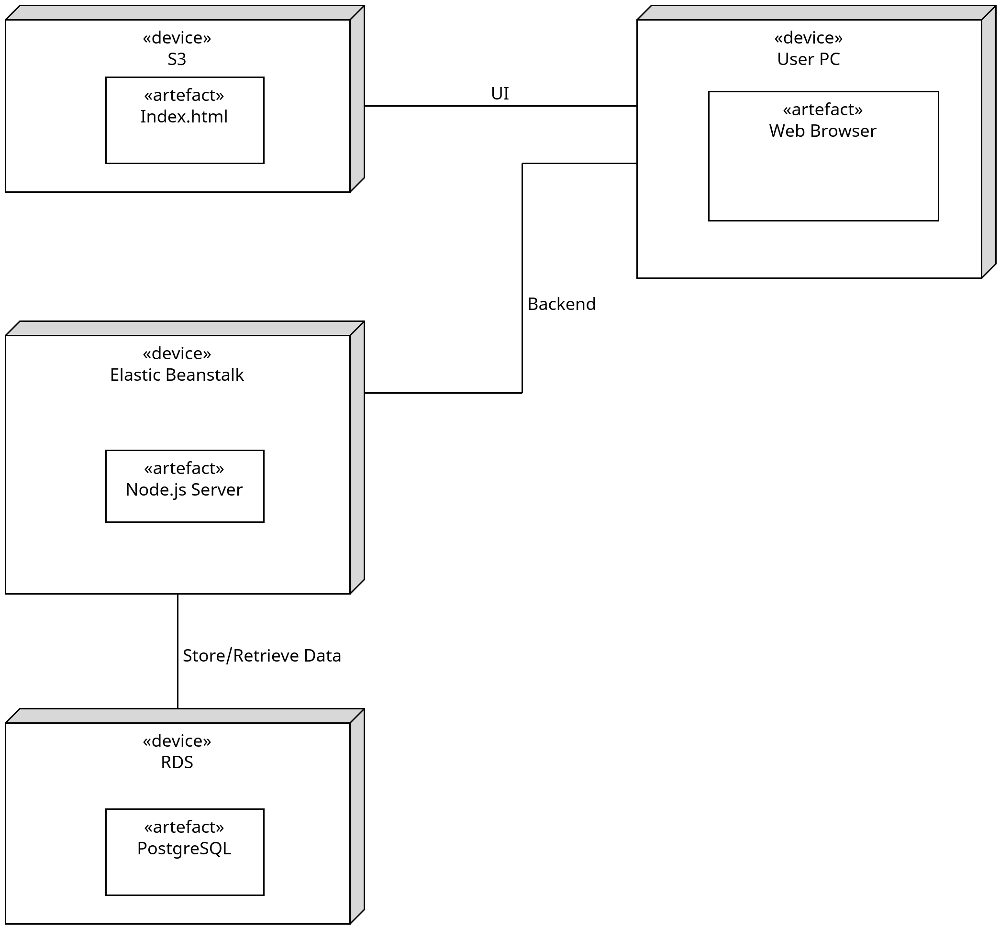

# Node.js and AWS Projects

- [Node.js and AWS Projects](#nodejs-and-aws-projects)
  - [Node.js Projects](#nodejs-projects)
    - [Images Processing API](#images-processing-api)
    - [Storefront API](#storefront-api)
  - [AWS Projects](#aws-projects)
    - [Deploying a Full-Stack Application](#deploying-a-full-stack-application)

## Node.js Projects

### Images Processing API

[GitHub Repo](https://github.com/anazhmetdin/ImgsAPI)

- Images Processing API developed with Node.js and tested using Jasmine.
- The API is organized into separate folders for API endpoints and middleware, ensuring maintainability and easy extension.
- Processed images are cached in the thumbs folder.
- Designed for flexibility, scalability, and seamless integration.

Home Page

Images Endpoint Documentation

Example of the Images endpoint

### Storefront API

[GitHub Repo](https://github.com/anazhmetdin/storefront)

- Node.js project with TypeScript, bcrypt.js and Jasmine for building an online storefront API.
- The database was constructed using migrations and hosted on PostrgreSQL.
- Endpoints are defined following the pattern of RESTful APIs.
- API Architecture is separted into route, middlewares, models and tests. Where each endpoint is fully tested.
- Some Endpoints require authorization like placing an order.

## AWS Projects

### Deploying a Full-Stack Application

[GitHub Repo](https://github.com/anazhmetdin/deployment-process)

- This project demonstrates successful deployment and integration of the frontend and backend components on AWS.
- The deployment process was automated using AWS CLI and auto-started by setting up a CD/CI pipeline on CircleCI.
- All secrets were handled profissionally and passed through enviromnt variables on each platform to maximize the application security.

Pipeline:

1. Push Commits to GitHub
2. Trigger CircleCI Workflow
3. Install node and checkout code
4. Install dependencies (Front-end & Backend)
5. Build (Front-end & API)
6. Deploy API to Elastic Beanstalk
7. Deploy UI to S3

Infrastructure Description:

- AWS RDS: Database Server [PostgreSQL]
- AWS S3: Frontend
- AWS Elastic Beanstalk: Backend

